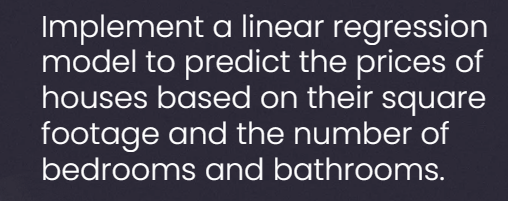
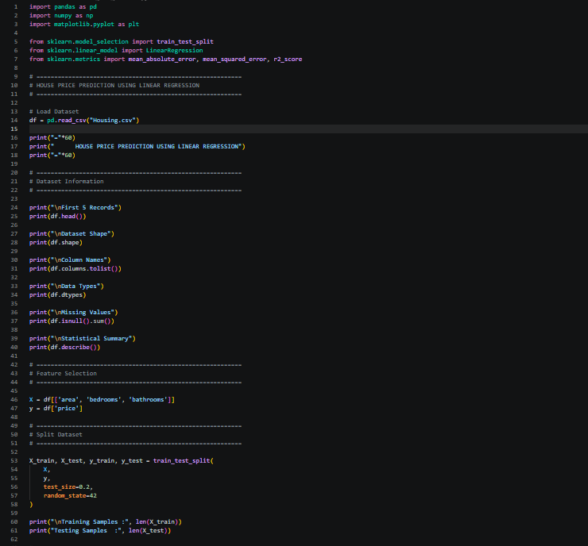
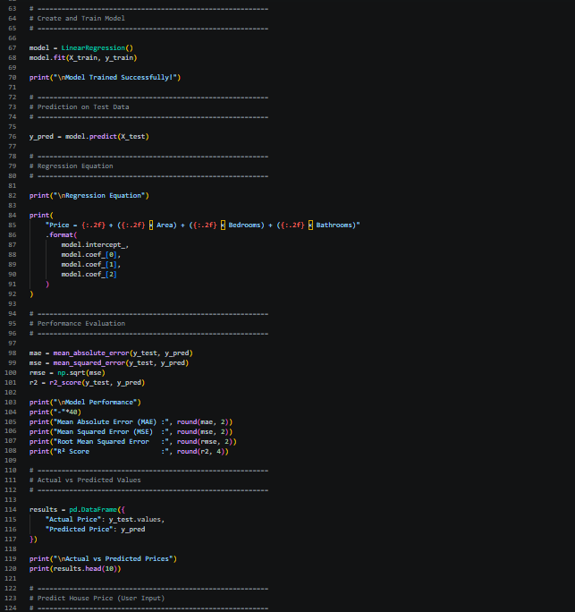
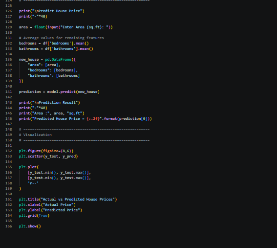
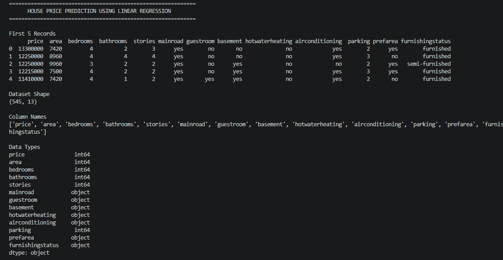
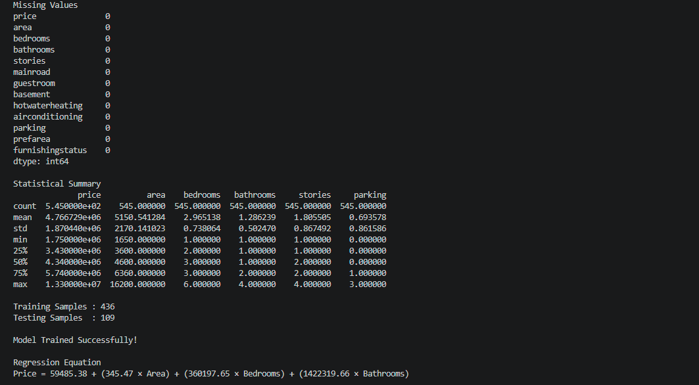
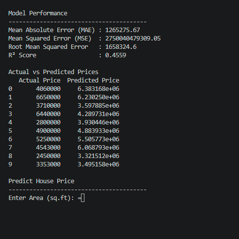

# SCT_ML_01 - House Price Prediction using Linear Regression

## 📌 Project Overview

This project implements a **Linear Regression** model to predict house prices based on important housing features such as **square footage**, **number of bedrooms**, and **number of bathrooms**. Linear Regression is one of the most widely used supervised machine learning algorithms for predicting continuous values.

---

## 🎯 Task Objective

Build a **Linear Regression** model to predict house prices using housing features including square footage, bedrooms, and bathrooms.

---

## 📋 Problem Statement

Implement a **Linear Regression** model to predict the prices of houses based on their square footage and the number of bedrooms and bathrooms.



---

# 💻 Python Implementation

### Code - Part 1



### Code - Part 2



### Code - Part 3



---

# 📊 Output

### Output - Part 1



### Output - Part 2



### Output - Part 3



---

# 🛠️ Technologies Used

- Python
- Pandas
- NumPy
- Matplotlib
- Scikit-learn

---

# 📂 Dataset

The project uses a housing dataset containing information such as:

- Square Footage
- Number of Bedrooms
- Number of Bathrooms
- House Price (Target Variable)

These features are used to train the Linear Regression model to predict house prices.

---

# ⚙️ Machine Learning Algorithm

## Linear Regression

Linear Regression is a supervised machine learning algorithm that models the relationship between one dependent variable (house price) and one or more independent variables (housing features).

The model learns from historical data and predicts the price of new houses based on the given features.

---

# 📁 Project Structure

```text
SCT_ML_01/
│
├── images/
│   ├── statement.png
│   ├── codepart1.png
│   ├── codepart2.png
│   ├── codepart3.png
│   ├── outputpart1.png
│   ├── outputpart2.png
│   └── outputpart3.png
│
├── house_price_prediction.py
├── Housing.csv
├── README.md
```

---

# ▶️ How to Run

### 1. Clone the repository

```bash
git clone https://github.com/venkataakhilsesetty/SCT_ML_01.git
```

### 2. Navigate to the project folder

```bash
cd SCT_ML_01
```

### 3. Install the required libraries

```bash
pip install pandas numpy matplotlib scikit-learn
```

### 4. Run the project

```bash
python house_price_prediction.py
```

---

# 📈 Results

- Successfully trained a Linear Regression model.
- Predicted house prices using housing features.
- Evaluated model performance using regression metrics.
- Generated predictions for unseen housing data.

---

# 🚀 Future Improvements

- Improve prediction accuracy using advanced regression algorithms.
- Perform feature engineering and feature selection.
- Apply cross-validation for better model evaluation.
- Develop a web application for real-time house price prediction.

---

# 👨‍💻 Author

**Venkata Akhil Sesetty**

Machine Learning Intern – SkillCraft Technology

---

⭐ If you found this project useful, consider giving it a **Star ⭐** on GitHub!